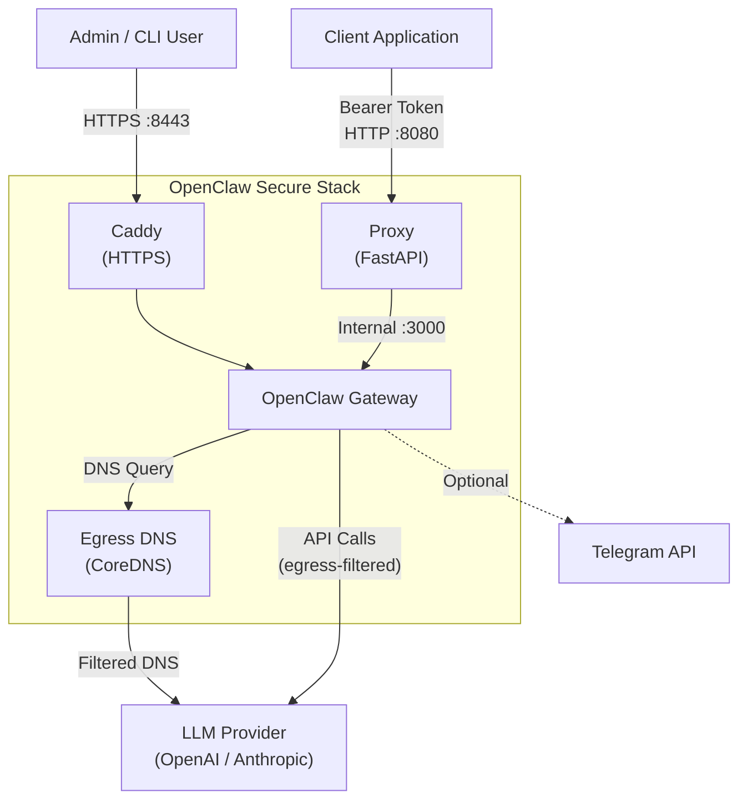
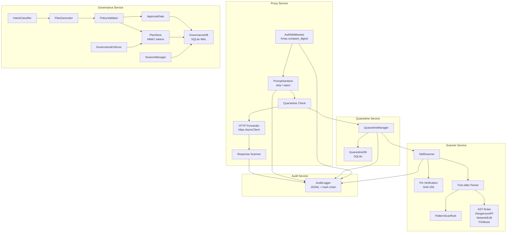
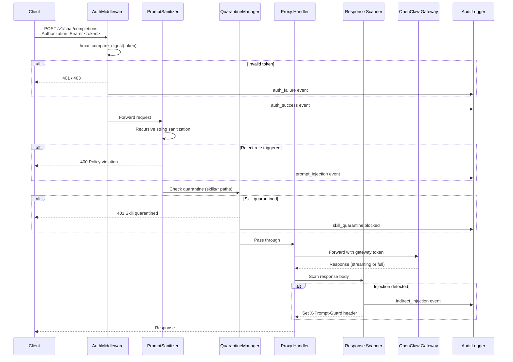
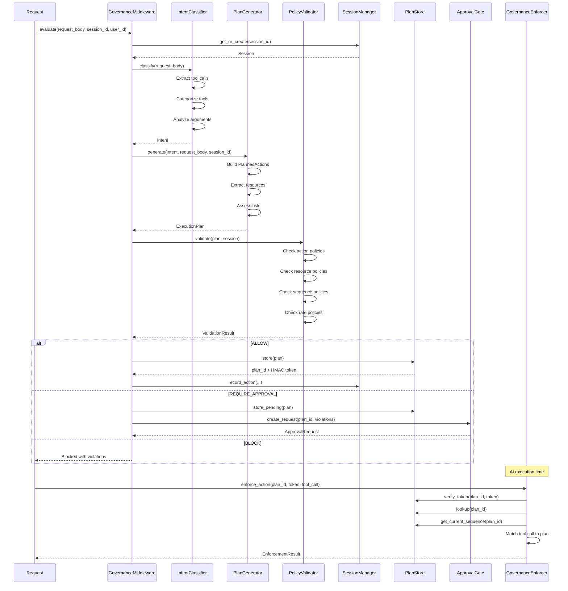
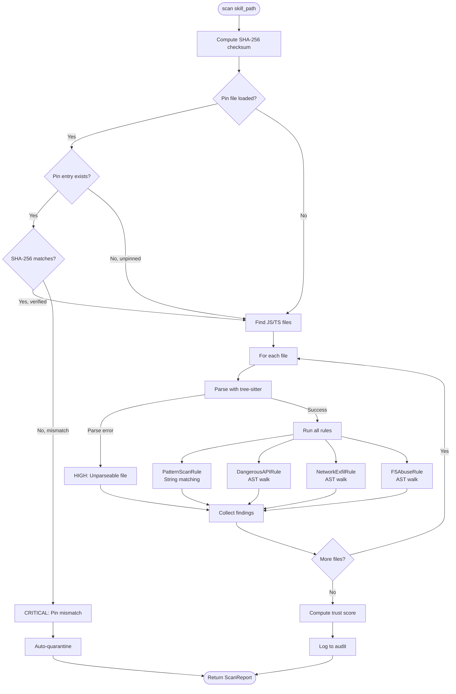
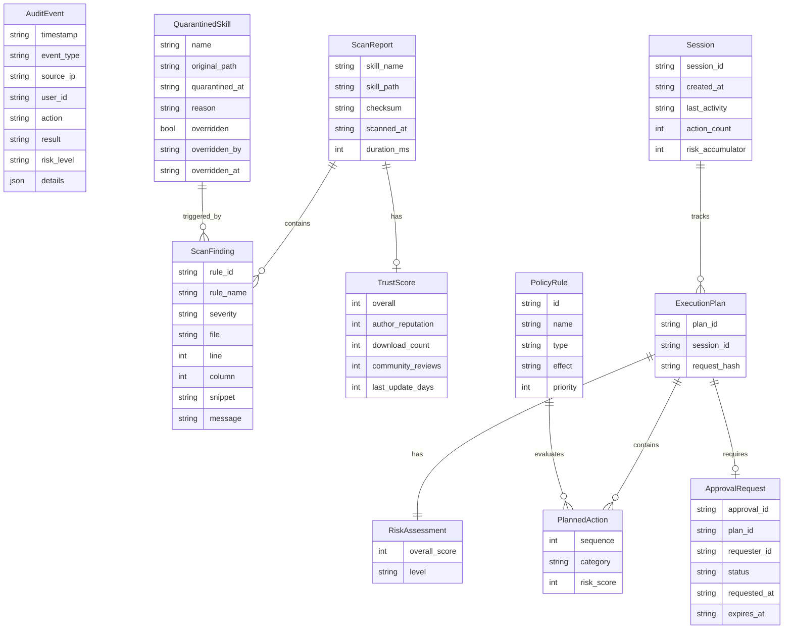
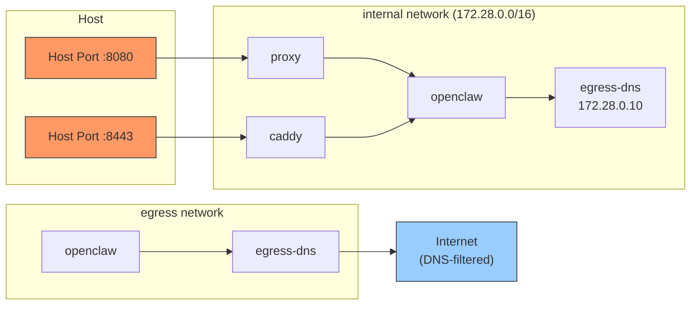
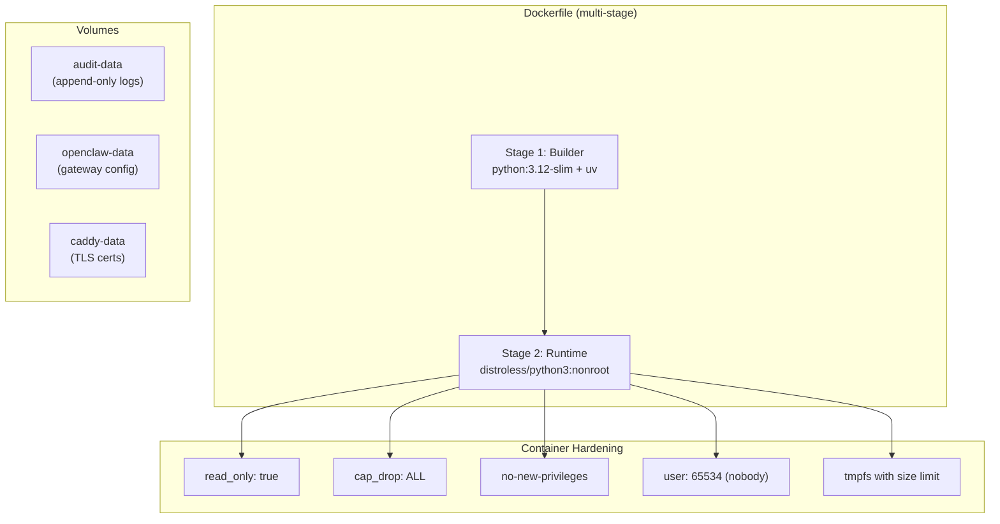

# Architecture Documentation

## System Context Diagram

## Component Diagram

## Request Lifecycle Sequence

## Governance Pipeline Sequence

## Skill Scan Flow

## Data Model Relationships

## Network Topology

## Deployment Architecture

